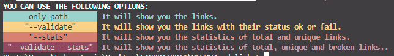
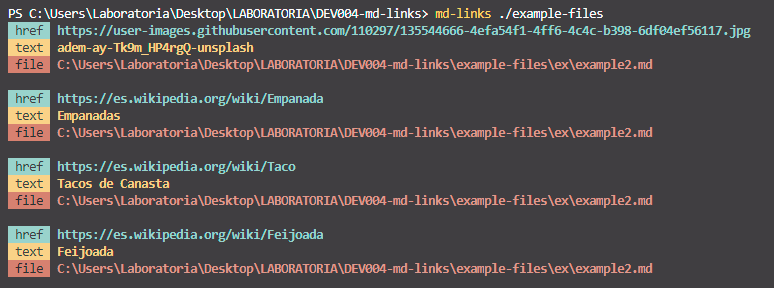
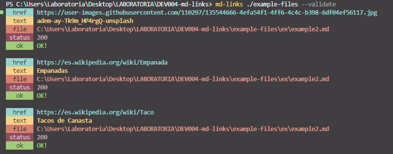
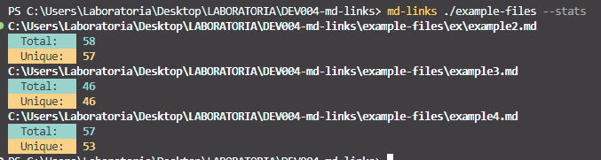
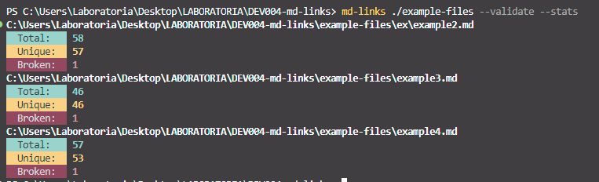
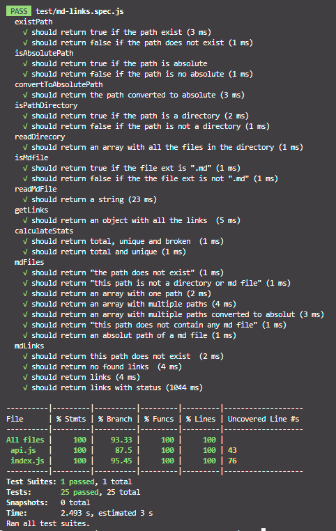

# Markdown links
## Índice

*[1. Resumen del proyecto](##1-Resumen-del-proyecto)*
*[2. Planeación de sprints](##2-Planeación-de-sprints)*
*[3. Diagramas de flujo](##3-Diagramas-de-flujo)*
*[4. Módulos del proyecto](##4-Módulos-del-proyecto)*
*[5.Modo de uso ](##5-Modo-de-uso)*
*[6.Pruebas unitarias ](##6-Pruebas-unitarias)*
*[7. Checklist](##7-Cheklist)*

## 1. Resumen del proyecto
Creación de una herramienta de línea de comando (CLI) así como una librería (o biblioteca - library) en JavaScript, que lea y analice archivos en formato `Markdown`, para verificar los links que contengan y reportar algunas estadísticas.

## 2. Planeación de sprints
*NT. No terminado durante ese sprint.*

### Sprint 1. 
 - [x] Crear diagrama de flujo API
 - [x] Crear diagrama de flujo CLI

### Sprint 2.
#### Validaciones API.
 - [x] Existe la ruta
 - [x] Es absoluta la ruta
 - [x] Convertir ruta relativa a absoluta
 - [x] Es directorio
 - [x] Leer directorio
 - [x] Es archivo .md
 - [x] Leer archivo .md
 - [x] Obtener links
 - [ ] Petición HTTP para status de links *(NT)*
 
#### Instalaciones
 - [x] Babel 
 - [x] Jest 
 - [x] Chalk

### Sprint 3.
#### Validaciones API
 
 - [x] Petición HTTP para status de links
 - [x] Calculo stats
 - [x] Calculo stats con status

#### Index
 - [ ] Función mdFiles *(NT)*

#### Test
 - [x] Existe la ruta
 - [x] Es absoluta la ruta
 - [x] Convertir ruta relativa a absoluta
 - [x] Es directorio
 - [x] Leer directorio
 - [x] Es archivo .md
 - [x] Leer archivo .md
 - [x] Obtener links
 - [ ]  Petición HTTP para status de links *(NT)*
 - [x] Calculo stats
 - [x] Calculo stats con status
 
### Sprint 4.
#### Index
 - [x] Implementa recursividad en función mdFiles
 - [ ] Función mdLinks *(NT)*

#### Test

 - [x] Función mdFiles

### Sprint 5.
#### Index

 - [ ] Función mdLinks *(NT)*
 - [ ] Corrección en mdLinks *(NT)*

#### Test

 - [ ] Función mdLinks *(NT)*

### Sprint 6.
#### Index

 - [x] Función mdLinks
 - [x] Corrección en mdLinks

#### Test

 - [x] Función mdLinks
 
#### CLI
 - [x] path
 - [x] --validate
 - [x] --stats
 - [x] --validate --stats
 - [x] --help
 - [x] !path
 - [x] Colores con librería chalk

#### Instalaciones

 - [X] ESLINT

#### READ ME

 - [x] README

## 3. Diagramas de flujo
Para la planeación de este proyecto se realizaron dos diagramas de flujo, Uno de los procesos que debe realizar la API y otro de lo que debe realizar el CLI.

## 4. Módulos del proyecto
### api.js
En este archivo se encuentran un objeto llamado **api**, dónde cada una de sus propiedades es una función que después se ejecuta en el *index.js*.  

Para acceder a cada función, es necesario colocar *api.funciónUtilizada*, por ejemplo para la función que valida si la ruta existe o no es: **api.existPath();**.

Este archivo importa fs, fsp y path de node.js, para las funciones que validan alguna parte de todo nuestro proceso. Además de axios, que es un cliente HTTP basado en promesas, y es el que hace la validación de cada uno de los links. 

### index.js
Este archivo contiene dos funciones, *mdFiles* y *mdLinks*.
La función **mdFiles();** se trata de una función recursiva que hace las primeras validaciones de nuestra api:

 - Comprobar si la ruta existe o no.
 - Comprobar si la ruta es absoluta, pero si es relativa transformarla.
 - Comprobar si la ruta es directorio, y leer los archivos dentro,
 - Comprobar que archivos son .md y formar un array con cada una de las rutas.

Si hay archivos **.md**, retorna un *array* con todas las rutas de los archivos. Si no, retorna el *error* correspondiente. 

La función **mdLinks();** retorna una promesa. En esta función hace lo restante de validaciones. 

 - Lee cada uno de los archivos .md.
 - Busca los links dentro del archivo.
 - Hace la petición HTTP si validate es true.

La promesa se resuelve con los links con o sin status, dependiendo de si validate es true o false. Y se rechaza con un mensaje de error dependiendo del caso que corresponda.

### cli.js
Este archivo contiene las condiciones para que se ejecute la línea de comandos. Importa la función *mdLinks* de **index.js**, y dependiendo de lo que se reciba en el *process.argv* ejecuta **mdLinks(path, true)** o **mdLinks(path, false)**. Y si es necesario, calcula las **estadísticas** de los links encontrados. 

## 5. Modo de uso
### Instalación
Se puede instalar este proyecto colocando en la terminal:

    npm install irene-mt/DEV004-md-links

### Ejecución de comandos
El comando principal es:

    md-links
Para visualizar las opciones de comandos se ejecuta:

    md-links --help

Para visualizar los **links** que se encuentran en el/los archivos md, se ejecuta:

    md-links <ruta del archivo> 
Por ejemplo:

    md-links ./example-files

Para visualizar los **links** y sus **status** *(ok o fail)*, se ejecuta:

    md-links <ruta del archivo> --validate

Por ejemplo:

    md-links ./example-files --validate

Para visualizar las **estádisticas** de los links, sin status, se ejecuta:

    md-links <ruta del archivo> --stats

Por ejemplo:

    md-links ./example-files --stats

Para visualizar las **estádisticas** de los links, con **status**, se ejecuta:

    md-links <ruta del archivo> --validate --stats

Por ejemplo:

    md-links ./example-files --validate --stats

## 6. Pruebas unitarias
Se realizaron un total de 25 test para las funciones de **api.js** e **index.js**, llegando casi a la totalidad de coverage. 

## 7. Checklist
### General
* [x] Puede instalarse via `npm install --global <github-user>/md-links`
###  `README.md`
* [x] Un board con el backlog para la implementación de la librería.
* [x] Documentación técnica de la librería.
* [x] Guía de uso e instalación de la librería

### API `mdLinks(path, opts)`
* [x] El módulo exporta una función con la interfaz (API) esperada.
* [x] Implementa soporte para archivo individual
* [x] Implementa soporte para directorios
* [x] Implementa `validate: true or false`

### CLI
* [x] Expone ejecutable `md-links` en el path (configurado en `package.json`)
* [x] Se ejecuta sin errores / output esperado
* [x] Implementa `--validate`
* [x] Implementa `--stats`  

### Pruebas / tests
* [x] Pruebas unitarias cubren un mínimo del 70% de statements, functions, lines, y branches.
* [x] Pasa tests (y linters) (`npm test`)